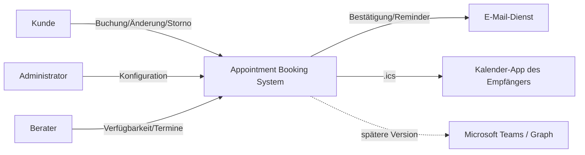

# 3 Kontext und Abgrenzung

## 3.1 Fachlicher Kontext

## 3.2 Externe Schnittstellen

- Browser über HTTPS.
- PostgreSQL-Verbindung nur serverseitig.
- E-Mail-Provider serverseitig.
- Objekt-/Medienspeicher für Profilbilder serverseitig.
- Später Microsoft Graph über OAuth/Anwendungsberechtigung hinter Adapter.

## 3.3 Vertrauensgrenzen

- Öffentliche Browserdaten sind grundsätzlich nicht vertrauenswürdig.
- Verwaltungslinks sind Secrets und dürfen nicht geloggt werden.
- Provider-Secrets bleiben ausschließlich serverseitig.

[PlantUML-Kontext](diagrams/context.puml) · [Fachliche Schnittstellen](../spec/S1-nachbarsysteme.md).
