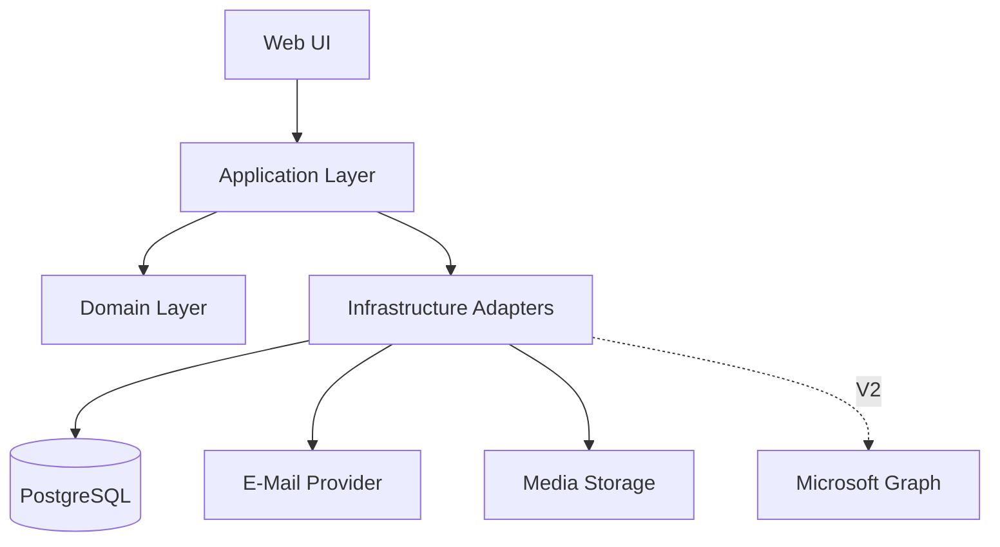

# 5 Bausteinsicht

## 5.1 Ebene 1

## 5.2 Web UI

### Public Booking UI
Routen für Profil-, Service-, Teilnehmer-, Kalender-, Detail-, Review- und Bestätigungsseiten.

### Internal UI
Rollenabhängige Bereiche für Admin/Berater. Middleware/Server Guards verhindern unauthorisierten Zugriff.

## 5.3 Application Layer

- `ListBookableProfiles`
- `ListProfileServices`
- `ResolveParticipantOptions`
- `GetMonthAvailability`
- `GetDaySlots`
- `CreateAppointment`
- `RescheduleAppointment`
- `CancelAppointment`
- `ManageWeeklyAvailability`
- `ManageAvailabilityException`
- `ManageProfiles`
- `ManageServices`
- `ManageRelations`
- `AuthenticateInternalUser`
- `RequestPasswordReset`
- `AnonymizeExpiredAppointments`
- `ProcessNotificationOutbox`

## 5.4 Domain Layer

### AvailabilityEngine
Pure/near-pure Logik für:
- Wochenintervalle
- Ausnahmen
- Überschneidungen
- Schnittmenge mehrerer Profile
- Slotgenerierung
- Servicedauer
- 24h/3-Monate-Regeln

### BookingPolicy
Prüft fachliche Zulässigkeit.

### ParticipantResolver
Löst ProfileRelations in konkrete auswählbare Teilnehmer auf.

### CalendarEventFactory
Erzeugt providerneutrale Termininformationen für `.ics` und spätere Meetingadapter.

### RetentionPolicy
Bestimmt Anonymisierungszeitpunkt.

## 5.5 Persistence

Repository-Abstraktionen für Users, Profiles, Services, Availability, Appointments, Notifications, Audit.

## 5.6 Integrationen

- `MailGateway`
- `CalendarFileGenerator`
- `MediaStorage`
- `MeetingProvider` (V1 Manual/None; V2 Teams)

## 5.7 Verträge und Abhängigkeitsrichtung

Die Domain verarbeitet Werte und Regeln ohne Datenbankzugriff. Application lädt über Repository-Ports, ruft Domain-Funktionen auf und hält die Transaktion. Infrastructure implementiert die Ports. Alle Einstiegspunkte (Serveraktionen, HTTP, Worker) verwenden dieselben Application-Guards und Policies.

| Modul | Eingabe / Ausgabe | Verantwortung und Daten |
|---|---|---|
| Profiles & Services | Profil-ID → aktive Services/Relationen | Katalogdaten; Admin-Mutationen prüfen Aktivierungsinvarianten |
| Availability | Profile, Service, Zeitraum, Regeln, Belegungen, Referenzzeit → Slots | Keine Seiteneffekte, keine Reservation durch Lesen |
| Booking | Validierter Entwurf und Idempotenzschlüssel → Termin oder Konflikt | Transaktion über Termin, Teilnehmerbelegungen, Outbox |
| Appointment Management | Autorisierter Termin, erwartete Version, Änderung → neue Version | Gleiches Kollisionsprotokoll wie Booking |
| Identity & Access | Cookie oder Kundenfähigkeit → begrenzter Zugriffskontext | Sessions, Reset-Token, Rechte; keine Kundenkonten |
| Notifications & Calendar | Terminversion und einzelner Empfänger → Versandresultat/ICS | Empfängerspezifische Projektion und Retry |
| Privacy & Audit | Frist und Uhrzeit → bereinigte Datensätze | Löschung von PII-Kopien; minimale Auditereignisse |

Zusätzliche technische Datensätze: Session, bibliotheksverwaltete Verifikations-/Resetdaten, BookingDraft, IdempotencyRecord und AppointmentReservation. Diese sind keine weiteren Geschäftsrollen. Reservation hält je bestätigtem Teilnehmer Profil-ID und Zeitbereich; Service- und Profildaten werden separat als historische Snapshots gespeichert.

[Use-Case-Zuordnung](../TRACEABILITY.md) · [Kollisionsentscheidung](../../adr/007-atomic-booking.md).

## 5.8 Verbindliche Adapterverträge

Diese Verträge reichen für die Entwicklung ohne produktive Zugangsdaten. Kein Adapter darf die Domain von einem konkreten Anbieter abhängig machen.

| Port | Vertrag und Fehler | Entwicklung/Test | Produktion |
|---|---|---|---|
| MailGateway | `send(message)` erhält opaque Auftrags-ID, genau einen Empfänger, Absenderkonfiguration, Betreff, Text/HTML und optionale ICS. Ergebnis: ACCEPTED mit Provider-ID oder RETRYABLE/PERMANENT/UNKNOWN mit bereinigtem Code. Timeout 10 Sekunden. Kein Retry im Adapter; Outbox steuert Wiederholung. Provider-Idempotenz nutzen, wenn unterstützt. | SMTP-Capture über Mailpit im lokalen Compose-Netz; zusätzlich InMemoryMailGateway mit deterministisch injizierbaren Fehlern. Empfänger ausschließlich Testdaten, kein Relay ins Internet. | Konfigurierbarer Adapter; Absender/Domäne, AVV und regionale Verarbeitung vor Go-live freigeben. |
| MediaStorage | `put(opaqueKey, validatedImage, mime)` veröffentlicht nur fertig geprüfte Derivate; `publicUrl(key)` liefert secretfreie Lese-URL; `delete(key)` ist bei fehlendem Objekt erfolgreich. Writes atomar pro Objekt, unveränderliche servergenerierte Keys; Fehler haben RETRYABLE/PERMANENT-Code. | LocalMediaStorage unter isoliertem Datenvolume außerhalb ausführbarer/public-Verzeichnisse; Auslieferung nur über Bildhandler. InMemory-Adapter für Fehlerfälle. | Nicht ausführbarer Object Storage; gleiche Tests für put/read/delete, Content-Type, ACL und URL. |
| MeetingProvider | `resolve(serviceConfig, concreteMode, contact)` liefert validierten MeetingSnapshot oder Konfigurationsfehler, ohne Reservation oder E-Mail. | ManualMeetingProvider, keine Netzaufrufe. | Derselbe manuelle Adapter in V1; Graph/Teams nicht aktiv. |
| CalendarFileGenerator | Empfängerspezifischer EventSnapshot → RFC-konforme UTF-8-ICS, ohne fremde Adressen oder Verwaltungstoken. | Reine Funktion mit REQUEST/CANCEL-Fixtures. | Identischer Code, kein externer Provider. |

HTTP/SMTP-Timeouts finden ausschließlich nach Termincommit statt. Mailpit ist ein Entwicklungswerkzeug, keine Lieferentscheidung für Produktion. Kein Laden nutzerangegebener Remote-Bild- oder Meeting-URLs auf dem Server (keine SSRF-Fläche).

## 5.9 MeetingSnapshot und interne Application-Operationen

ServicePolicyValidator prüft FIXED/CLIENT_CHOICE und erlaubte konkrete Modi. IN_PERSON erfordert Ort/Adresse; PHONE speichert Anrufrichtung und gegebenenfalls die konfigurierte Nummer, Standard ADVISOR_CALLS_CLIENT; ONLINE erfordert HTTPS-URL und provider MANUAL. URL darf keine Zugangsdaten im Authority-Teil und kein ausführbares Schema enthalten. Meeting-Links sind nur Beteiligten zugänglich, keine öffentlich gelisteten Servicedetails. Snapshot-Änderungen verändern keine Servicehistorie rückwirkend.

Zusätzlich zu den vorhandenen Operationen: `GetInternalAppointment`, `UpdateAppointmentDetails`, `ManageAppointmentGuests`, `ResendConfirmation`, `RecordAppointmentOutcome`, `ValidateMeetingConfiguration`, `TransitionProfile`, `ReplaceProfilePhoto`. Ihre erlaubten Felder, Empfänger und Statusbedingungen werden fachlich in [N2](../spec/N2-querschnittskonzepte.md) definiert. Ein Server-Guard prüft ADMIN oder tatsächliche Beteiligung des zugeordneten AdvisorProfile, niemals bloß ProfileRelation. Getrennte Werte `version` und `calendarSequence` verhindern, dass Metadatenänderungen den Kalender unnötig verändern.

Profile besitzen DRAFT/ACTIVE/INACTIVE und einen optionalen eindeutigen Accountbezug. PublicProjection filtert ACTIVE und vollständige Publikationsdaten einschließlich aktiver Services. Konto-Deaktivierung entzieht Login, verändert keine Profil-/Terminhistorie. Historische Snapshots referenzieren keine austauschbare Fotodatei; damit kann deren alte Version sicher gelöscht werden.
