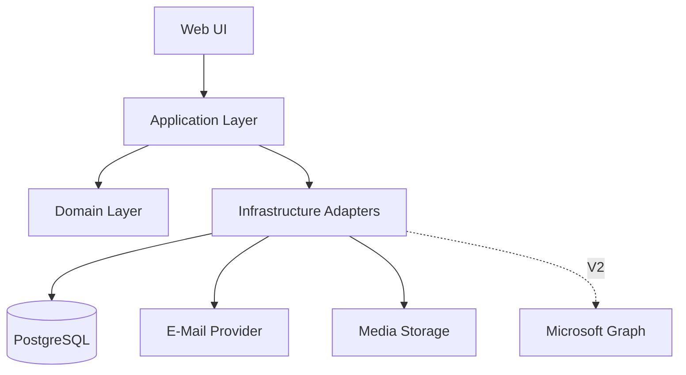

# 5 Bausteinsicht

## 5.1 Ebene 1

## 5.2 Web UI

### Public Booking UI
Routen für Profil-, Service-, Teilnehmer-, Kalender-, Detail-, Review- und Bestätigungsseiten.

### Internal UI
Rollenabhängige Bereiche für Admin/Berater. Middleware/Server Guards verhindern unauthorisierten Zugriff.

## 5.3 Application Layer

- `ListBookableProfiles`
- `ListProfileServices`
- `ResolveParticipantOptions`
- `GetMonthAvailability`
- `GetDaySlots`
- `CreateAppointment`
- `RescheduleAppointment`
- `CancelAppointment`
- `ManageWeeklyAvailability`
- `ManageAvailabilityException`
- `ManageProfiles`
- `ManageServices`
- `ManageRelations`
- `AuthenticateInternalUser`
- `RequestPasswordReset`
- `AnonymizeExpiredAppointments`
- `ProcessNotificationOutbox`

## 5.4 Domain Layer

### AvailabilityEngine
Pure/near-pure Logik für:
- Wochenintervalle
- Ausnahmen
- Überschneidungen
- Schnittmenge mehrerer Profile
- Slotgenerierung
- Servicedauer
- 24h/3-Monate-Regeln

### BookingPolicy
Prüft fachliche Zulässigkeit.

### ParticipantResolver
Löst ProfileRelations in konkrete auswählbare Teilnehmer auf.

### CalendarEventFactory
Erzeugt providerneutrale Termininformationen für `.ics` und spätere Meetingadapter.

### RetentionPolicy
Bestimmt Anonymisierungszeitpunkt.

## 5.5 Persistence

Repository-Abstraktionen für Users, Profiles, Services, Availability, Appointments, Notifications, Audit.

## 5.6 Integrationen

- `MailGateway`
- `CalendarFileGenerator`
- `MediaStorage`
- `MeetingProvider` (V1 Manual/None; V2 Teams)

## 5.7 Verträge und Abhängigkeitsrichtung

Die Domain verarbeitet Werte und Regeln ohne Datenbankzugriff. Application lädt über Repository-Ports, ruft Domain-Funktionen auf und hält die Transaktion. Infrastructure implementiert die Ports. Alle Einstiegspunkte (Serveraktionen, HTTP, Worker) verwenden dieselben Application-Guards und Policies.

| Modul | Eingabe / Ausgabe | Verantwortung und Daten |
|---|---|---|
| Profiles & Services | Profil-ID → aktive Services/Relationen | Katalogdaten; Admin-Mutationen prüfen Aktivierungsinvarianten |
| Availability | Profile, Service, Zeitraum, Regeln, Belegungen, Referenzzeit → Slots | Keine Seiteneffekte, keine Reservation durch Lesen |
| Booking | Validierter Entwurf und Idempotenzschlüssel → Termin oder Konflikt | Transaktion über Termin, Teilnehmerbelegungen, Outbox |
| Appointment Management | Autorisierter Termin, erwartete Version, Änderung → neue Version | Gleiches Kollisionsprotokoll wie Booking |
| Identity & Access | Cookie oder Kundenfähigkeit → begrenzter Zugriffskontext | Sessions, Reset-Token, Rechte; keine Kundenkonten |
| Notifications & Calendar | Terminversion und einzelner Empfänger → Versandresultat/ICS | Empfängerspezifische Projektion und Retry |
| Privacy & Audit | Frist und Uhrzeit → bereinigte Datensätze | Löschung von PII-Kopien; minimale Auditereignisse |

Zusätzliche technische Datensätze: Session, PasswordResetToken, BookingDraft, IdempotencyRecord und AppointmentReservation. Diese sind keine weiteren Geschäftsrollen. Reservation hält je bestätigtem Teilnehmer Profil-ID und Zeitbereich; Service- und Profildaten werden separat als historische Snapshots gespeichert.

[Use-Case-Zuordnung](../TRACEABILITY.md) · [Kollisionsentscheidung](../../adr/007-atomic-booking.md).
