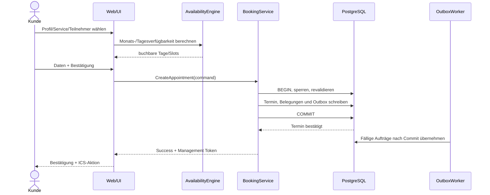

# 6 Laufzeitsicht

## 6.1 Neue Buchung

## 6.2 Mehrpersonen-Verfügbarkeit

1. Für jedes ausgewählte Profil effektive Zeitintervalle auflösen.
2. Intervalle normalisieren.
3. Schnittmenge bilden.
4. Aktive Terminbelegungen abziehen.
5. Servicedauer und Slot-Schritt anwenden.
6. Nur Startzeiten innerhalb Buchungsfenster zurückgeben.

## 6.3 Umbuchung

Umbuchung läuft in einer Transaktion. Neuer Slot wird geprüft/reserviert, bevor die alte Belegung final freigegeben wird. Danach Kalendersequenz erhöhen und Änderungsnachrichten in Outbox legen.

## 6.4 E-Mail-Fehler

Notification Processor versucht Versand. Bei Fehler bleibt Termin unverändert; Notification erhält `FAILED`, Retry-Zähler und nächste Versuchzeit.

## 6.5 Session Guard

Jeder Request an private Route:
1. Session-Cookie lesen.
2. DB-Session validieren.
3. Idle-/Absolute-Timeout prüfen.
4. Benutzer/Rolle/Berechtigung prüfen.
5. Aktivitätstimestamp aktualisieren.
6. Fehlende/abgelaufene Sitzung: Seitenaufruf nach `/login`, API/Mutation mit 401. Fehlendes Recht: 403 ohne Daten. Kein Redirect als Ersatz für Autorisierung.

## 6.6 Konkurrenz, Wiederholung und Teilfehler

Parallele Bestätigungen sperren dieselben Profile in sortierter Reihenfolge. Nach der Sperre wird der Zustand neu gelesen. Höchstens ein konkurrierender Termin kann committen; ein Verlierer erhält 409 und aktualisierte Slots. Bei Constraintverletzung wird die gesamte Transaktion einschließlich Outbox zurückgerollt. Verbindungsabbruch nach Commit: Wiederholung desselben Idempotenzschlüssels liefert dieselbe Buchung, keine zweite.

Umbuchungen sperren alte und neue beteiligte Ressourcen sowie den Termin; erwartete Version verhindert verlorene Updates. Die eigene alte Belegung wird bei Verfügbarkeitsprüfung ausgeblendet. Bei Fehlschlag bleibt sie bestehen. Erfolgreich: Belegung ersetzen, Sequenz erhöhen, alte Reminder verwerfen, neue Aufträge schreiben und gemeinsam committen.

## 6.7 Aufbewahrung und Passwortreset

Retention-Worker liest fällige Termine, sperrt sie portionsweise und entfernt PII einschließlich Outbox-Payload, Entwurf, Token und freiem Snapshot-Text. Wiederholung ist wirkungsgleich. Fehler rollen den betroffenen Abschnitt zurück und erzeugen ein bereinigtes Betriebssignal.

Reset-Anfrage antwortet gleich für existierende/nicht existierende Konten. Der Bibliotheks-Einmaltoken wird atomar verbraucht; die Projektintegration serialisiert pro Konto und invalidiert alte Sitzungen fail-closed über die Sicherheitsgeneration gemäß ADR-011. Passwort-Hash wird ersetzt, weitere Resetnachweise und Sessions widerrufen. Kein pauschales Transaktionsversprechen über Bibliotheksaufrufe; bei Teilfehler bleibt der Zugriff gesperrt und ein neuer Reset wird verlangt. Ein konkurrierender zweiter Gebrauch schlägt fehl.

Diagrammquelle: [Buchungssequenz](diagrams/booking-sequence.puml). Die Abnahmefälle sind [A10](A10-quality-requirements.md) zugeordnet.

## 6.8 Erinnerung ohne Sofortduplikat

In der Erstellungs-/Umbuchungstransaktion wird eine Referenzzeit `now` erfasst. `reminderAt = startUtc - 24h`; nur wenn `reminderAt > now` wird ein Reminderauftrag angelegt. Bei Gleichheit oder Vergangenheit genügt Bestätigung bzw. Änderungsbestätigung. Alte Reminder werden bei Umbuchung ersetzt, bei Absage entwertet; kein Nachholen als zweite Sofortmail. Im Worker werden Fälligkeit, aktuelle Reminder-Generation, CONFIRMED und Beginn in der Zukunft erneut geprüft. Ein Metadatenupdate darf keinen zweiten Reminder erzeugen.

## 6.9 Interne Änderung, Gäste und erneuter Versand

1. DB-Sitzung, aktive Identität, Rolle und tatsächliche Beteiligung prüfen; erwartete Terminversion und eine mutationsspezifische Idempotenz-ID verlangen.
2. Policy-Lock, Profil-Locks in stabiler Reihenfolge und Termin-Lock erwerben. Berechtigungen unter Sperre erneut prüfen; gleichzeitige Kontodeaktivierung/Rollenänderung darf keine neue Mutation nach ihrem Commit zulassen.
3. Feld-Allowlist, konkreten Meetingmodus und Status prüfen. Für Änderungen eines bestehenden bestätigten Termins die Verfügbarkeit aller tatsächlichen Berater unter Ausschluss der eigenen Reservation erneut prüfen. Statusabschluss und Absage prüfen die vorhandene Belegung, dürfen aber durch nachträglich geänderte Verfügbarkeit nicht unmöglich werden. Ein reiner erneuter Versand ändert keine Belegung.
4. Neue Version, ggf. Kalendersequenz, minimalen AuditLog und empfängerbezogene Outboxaufträge gemeinsam schreiben. Gästeänderung berechnet die Mengen neu/beibehalten/entfernt; ein entfernter bisheriger Gast erhält nur seine Absage mit alter sicherer Terminsicht. Danach keinerlei Terminupdates an ihn.
5. Erst nach Commit versenden. Manuelles Resend erzeugt ein eigenes Ereignis ohne Änderung der Kalendersequenz; gleiche Command-ID ist idempotent. Wenn Kunde gewählt, Token rotieren, alte ausstehende geheime Payloads entwerten und neuen Link nur für diesen Kunden verschlüsselt vormerken.

`COMPLETED`/`NO_SHOW` nur nach Ende, aus CONFIRMED, mit Audit und Versionswechsel; keine E-Mail und keine Kalendersequenzänderung. Reservation wird atomar entfernt. Derselbe gewünschte Abschluss ist bei Wiederholung wirkungsgleich; Wechsel zwischen terminalen Status bleibt gesperrt.
