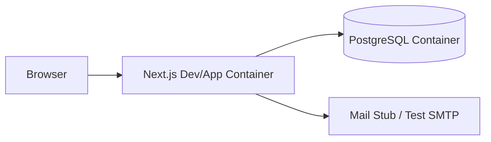
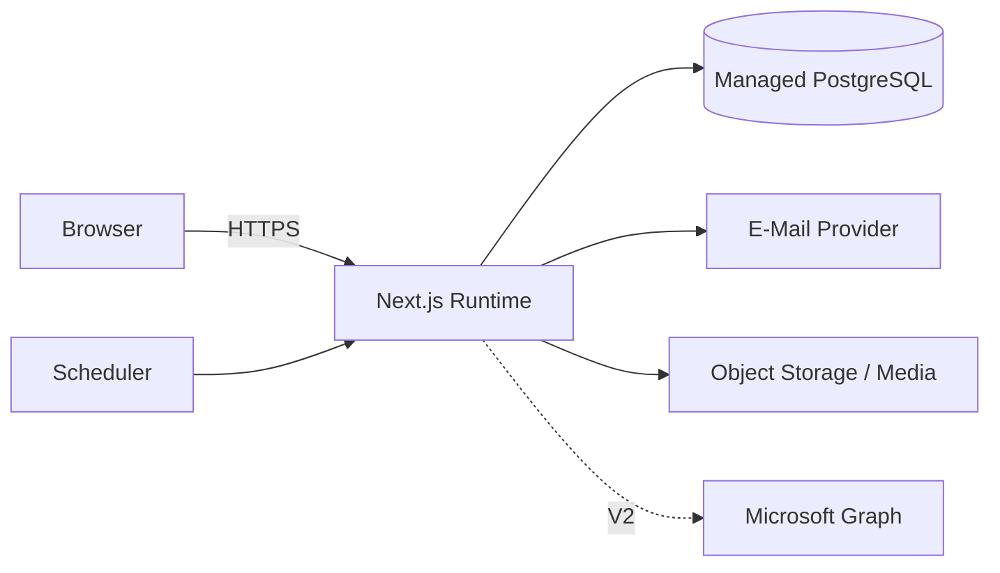

# 7 Verteilungssicht

## 7.1 Lokale Entwicklung

Docker Compose stellt mindestens App und PostgreSQL bereit. Lokale Provider-Stubs verhindern versehentliche echte E-Mails.

## 7.2 Produktion

## 7.3 Produktionsanforderungen

- TLS/HTTPS.
- Secrets über Hosting-Secret-Store.
- PostgreSQL-Backups.
- EU/EEA-Region bzw. rechtlich geeignete Datenübertragung/AV-Verträge.
- Scheduler für Notification-Retries, Reminder und Retention-Jobs.
- Keine Schreibzugriffe auf flüchtiges lokales Dateisystem für persistente Profilbilder.

## 7.4 Betriebsablauf und Entwicklungsziele

Web und Worker stammen aus demselben modularen Anwendungspaket, können aber getrennte Prozesse sein. Scheduler startet jede Minute Outbox/Reminder und täglich Retention; ausschließlich authentifizierter interner Trigger, niemals frei zugänglicher Job-Endpunkt. Leases schützen vor mehrfach gestarteten Workern. Datenbank ist nicht öffentlich erreichbar. Entwicklung, Staging und Produktion haben getrennte Secrets, Daten und Empfängerfreigaben.

Vor Start: Migrationen kontrolliert als einmaliger Release-Schritt ausführen, Schema-Kompatibilität prüfen, interne Erstadministration über gesicherten Einmalprozess anlegen. Keine Standardpasswörter. Danach Health-Check und Testbuchung mit Staging-Empfängern. Rollback der Anwendung nur bei kompatiblem Schema; destruktive Migrationen erfordern eigene Wiederherstellungsplanung.

Initiale Betriebsziele: tägliches verschlüsseltes Backup, maximal 24 Stunden Datenverlust (RPO), Wiederherstellung innerhalb 4 Stunden (RTO), 30 Tage Backupaufbewahrung. Monatliche Wiederherstellungsprobe in isolierter Umgebung; nach Restore fällige Retention erneut anwenden und Outbox zunächst pausieren, um historische Nachrichten nicht erneut zu versenden. Betreiber bestätigt diese Ziele vor Produktion.

Überwacht werden: DB-Erreichbarkeit, fehlgeschlagene Buchungen/Kollisionen, ältester Outboxauftrag, letzter Schedulerlauf, Retention-Rückstand und Backupstatus. Alarm bei Schedulerstille >5 Minuten, versandfähigem Auftragsalter >15 Minuten oder Retention-Rückstand >24 Stunden. Keine PII in Metriken. Betrieb verantwortet Alarmannahme und Wiederaufnahme.

[Deployment-Diagramm](diagrams/deployment.puml) · [Go-Live-Kriterien](../spec/S3-inbetriebnahme.md).

## 7.5 Sicherheitsbetrieb und Produktionsfreigabe

Lokale Adapter und Volumes sind in [A05](A05-building-block-view.md) festgelegt. In Produktion ist HTTPS Pflicht. Erst nach validierter Domäne HSTS einschalten, zunächst kontrolliert ausrollen; `includeSubDomains`/Preload nur nach gesonderter Prüfung aller Subdomains. Header werden am kontrollierten Anwendungseingang gesetzt und auch auf Fehler-/Weiterleitungsantworten geprüft.

Abhängigkeiten werden versioniert und beim ersten Code-Commit gelockt; regelmäßige monatliche Updateprüfung, tägliche Meldung bekannter Sicherheitslücken im Dependency-Scan. Bei kritischer ausnutzbarer Lücke priorisierte Behebung vor weiterer Veröffentlichung, bei Bedarf betroffenen Einstieg sperren. Staging-Abnahme, dokumentierter Rollback und Verantwortlicher sind Pflicht. Secrets bleiben außerhalb Repository, Browser und Logs; Rotation nach Vorfall/Personalwechsel. Backup- und Restore-Tests weisen die Art.-32-Maßnahmen technisch nach, ersetzen aber keine Betreiberfreigabe.

Vor Go-live gelten die [organisatorischen und rechtlichen Gates](../LEGAL-COMPLIANCE-DE.md) und [S3](../spec/S3-inbetriebnahme.md). Keine Behauptung bereits vorhandener AVV, Domains, Betreibertexte oder rechtlicher Qualifikation.
