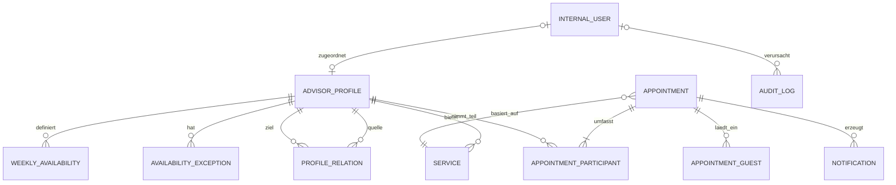

# D1 — Fachliches Datenmodell

## Fachliche Entitäten

| Entität | Fachliche Werte und Verantwortung |
|---|---|
| `InternalUser` | Interne Login-Identität mit E-Mail, Rolle `ADMIN`/`ADVISOR` und Kontostatus. Keine Kundenkonten. Ein Konto hat höchstens ein Profil; ein Profil hat höchstens ein optionales Konto. |
| `AdvisorProfile` | Name, Foto, Rolle/Titel, Kurzbeschreibung, eigene Benachrichtigungs-E-Mail und `ProfileStatusDT`. Eigenständig ohne Login-Konto anlegbar. Die Profil-E-Mail bleibt für Terminbenachrichtigungen erreichbar, auch wenn das Konto deaktiviert ist. |
| `Service` | Ausschließlich ein Termintyp genau eines Profils: Name, Beschreibung, Dauer, Aktivstatus, `meetingModePolicy`, nichtleere `allowedMeetingModes` und Konfiguration je angebotenem Modus. Kein kommerzielles Produkt. |
| `WeeklyAvailability` | Null bis mehrere lokale Zeitintervalle je Wochentag und Profil. |
| `AvailabilityException` | Datum/Zeitraum mit Blockierung, ersetzenden oder ergänzenden Tagesintervallen. |
| `ProfileRelation` | Gerichtete, je Quell-/Zielpaar eindeutige Beziehung verschiedener Profile, mit Vorauswahl und Entfernbarkeit. Keine Zugriffsberechtigung. |
| `Appointment` | Start/Ende als UTC-Instant, Status, Kunden- und Service-Snapshot, genau ein konkreter `meetingMode` samt Meeting-Snapshot, stabile Kalender-UID, `calendarSequence`, optimistische `version`, Verwaltungs-Token-Hash und Ablauf. |
| `AppointmentParticipant` | Tatsächlicher interner Profilteilnehmer und Rollen-Snapshot `PRIMARY`/`ADDITIONAL`. Nur diese Profile beeinflussen Verfügbarkeit, Eigentumsprüfung und interne Terminbenachrichtigungen. |
| `AppointmentGuest` | Explizit eingeladene externe E-Mail-Adresse ohne Kalenderbelegung oder Verwaltungsrecht. Entfernte Gäste sind keine aktuellen Empfänger; eine einmalige Absage informiert über das Ende ihrer bisherigen Beteiligung. |
| `Notification` | Versandauftrag mit fachlichem Ereignis, Terminversion, gegebenenfalls Kalendersequenz, einzelnen Empfänger, sicherer Empfängerprojektion und Fälligkeit. Ein Wiederholungsversuch ist kein neues Ereignis. |
| `AuditLog` | Ereigniszeit, Akteur (interner Nutzer/Kundenfähigkeit/System), Aktion, Termin-/Ressourcen-ID, Version, geänderte Feldnamen und Empfängeranzahl; keine Tokens, Kontaktwerte oder freien Wünsche. |
| `SystemSettings` | Unter anderem `timeZone`, initial und in V1 ausschließlich `Europe/Berlin`, Slot-Raster, Vorlauf, Horizont, Reminder- und Aufbewahrungsregeln. |

## Meetinginvarianten

- `MeetingModeDT` umfasst ausschließlich `IN_PERSON`, `PHONE`, `ONLINE`. `CLIENT_CHOICE` ist ausschließlich eine Servicepolitik aus `MeetingModePolicyDT`.
- `allowedMeetingModes` enthält mindestens einen eindeutigen konkreten Modus. `FIXED` verlangt genau einen; `CLIENT_CHOICE` lässt eine oder mehrere konfigurierte Optionen zu und speichert die gewählte Option ausdrücklich.
- Ein aktiver Service ist nur gültig, wenn für jeden angebotenen Modus alle nötigen Angaben nach [D2](D2-datentypen.md) vorhanden sind. `IN_PERSON` verlangt Ort/Adresse, `PHONE` die Anrufrichtung und gegebenenfalls die Beraternummer, `ONLINE` eine gültige HTTPS-URL und eine verständliche Providerbezeichnung.
- Ein bestätigter Termin speichert immer genau einen erlaubten Modus und dessen zugehörige Angaben als Snapshot; nicht verwendete Modusfelder bleiben leer. Spätere Serviceänderungen überschreiben keinen bestehenden Termin.
- Kundenumbuchung darf nur einen aktuell angebotenen Modus des bisherigen Services wählen; bei bloßer Zeitänderung bleiben gespeicherte Meetinginformationen erhalten. Interne Änderung darf gültige terminspezifische Orts-/Telefon-/Onlineinformationen setzen. Ein Moduswechsel muss eine aktuell erlaubte Serviceoption verwenden. Unveränderter Modus und Snapshot bleiben auch nach Service-/Profildeaktivierung gültig; bestehende Termine dürfen mit unveränderter Beratermenge weiter intern verwaltet oder kundenseitig fristgerecht umgebucht werden. Neue Buchungen mit inaktiven Profilen/Services sind gesperrt. Verfügbarkeit und Kollisionen werden weiterhin geprüft.

## Profil- und Kontolebenszyklus

| Übergang / Operation | Vorbedingungen und Wirkung |
|---|---|
| Profil erstellen → `DRAFT` | Kein Konto und kein Service erforderlich; öffentlich unsichtbar. |
| `DRAFT` oder `INACTIVE` → `ACTIVE` | Name, geprüftes Foto, Rolle/Titel, Kurzbeschreibung, gültige Profil-E-Mail und mindestens ein aktiver, vollständig konfigurierter Service vorhanden. Konto ist optional. |
| `ACTIVE` → `INACTIVE` | Sofort keine neuen Buchungen als Primär- oder Zusatzprofil; bestehende Termine, Snapshots und Benachrichtigungen bleiben erhalten. Admin verwaltet Profile ohne nutzbares Konto. |
| `INACTIVE` → `ACTIVE` | Erneute vollständige Publikationsprüfung. `DRAFT` wird nach erster Aktivierung nicht wiederverwendet. |
| Letzten aktiven Service deaktivieren | Bei `ACTIVE` ablehnen; zuvor Profil ausdrücklich deaktivieren. Kein stiller Profilstatuswechsel. |
| Konto deaktivieren | Alle Sessions widerrufen, private Nutzung sofort gesperrt; Profilstatus und bestehende Termine bleiben unverändert. Für einen Buchungsstopp Profil separat deaktivieren. |
| Konto zuordnen | ADMIN ordnet ein noch nicht anderweitig zugeordnetes Konto/Profil zu. Rollenrecht und Profilteilnahme bleiben getrennte Prüfungen. |
| Profil/Service löschen | Mit historischen Referenzen niemals Hard Delete; in V1 stets Deaktivierung. Fotos dürfen ersetzt werden, historische Termine referenzieren keine Fotoobjekte. |
| Letzten aktiven ADMIN deaktivieren/Rolle entziehen | Unter Sperre ablehnen, auch bei zwei gleichzeitigen Adminänderungen. |

## Terminlebenszyklus und Referenzintegrität

- Jeder Termin hat mindestens einen tatsächlichen Berater und genau einen Primärberater. Der Primärberater besitzt den gewählten Service; Teilnehmer sind eindeutig.
- Nur direkte Profilbeziehungen des Primärprofils werden aufgelöst, ohne rekursive Verkettung. Pflichtteilnehmer sind vorausgewählt und nicht entfernbar; inaktive Pflichtteilnehmer machen neue Buchungen unbuchbar.
- `CONFIRMED` belegt alle Beraterressourcen im halboffenen Intervall `[start,end)`. Ein Berater kann darin nicht gleichzeitig einen zweiten bestätigten Termin haben.
- Zeit-/Detail-/Gästeänderungen und manueller Bestätigungsversand sind nur für `CONFIRMED` und vor Terminende zulässig. Für eine neue Startzeit gilt bei interner Umbuchung `start >= now`; ein unverändert bereits begonnener Termin ist dadurch keine neue Buchung. Kundenaktionen verlangen weiterhin `start - now > 24h`.
- `CONFIRMED → CANCELLED` ist eine explizite Absage vor Terminende. `CONFIRMED → COMPLETED` oder `NO_SHOW` ist intern erst bei `now >= end` erlaubt. Terminale Status lassen sich in V1 weder reaktivieren noch gegenseitig korrigieren; Wiederholung desselben Ergebnisses ist ohne weitere Ereignisse idempotent.
- Änderung erhält Terminidentität und UID. `version` steigt pro erfolgreicher fachlicher Änderung; `calendarSequence` steigt nur gemäß der [Ereignismatrix](N2-querschnittskonzepte.md#n211-aenderungen-und-empfaenger). Abschluss und manuelles Resenden erzeugen keine Kalenderänderung.
- Nicht abgeschlossene vergangene Termine werden für die Aufbewahrung ab Endzeit wie abgeschlossene behandelt. Deaktivierung von Profil/Konto/Service löscht oder storniert keinen Termin und entfernt keine Teilnehmer.

Die Kundenrufnummer gehört nur in autorisierte Kontaktdaten/Ansichten, nicht in ICS; PHONE-ICS zeigt beim Berateranruf nur die Anrufrichtung. Die öffentliche Berater-Zielnummer bei CLIENT_CALLS_ADVISOR darf Bestandteil der empfängerbezogenen Meetingdaten sein.
