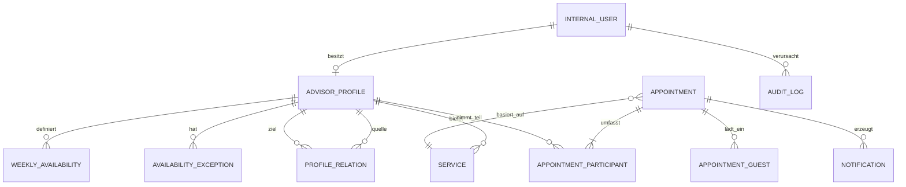

# D1 — Fachliches Datenmodell

## Fachliche Entitäten

### InternalUser
Interner Login für Administrator oder Berater. Keine Kundenkonten.

### AdvisorProfile
Öffentlich sichtbares Beraterprofil. Enthält fachliche Präsentationsdaten und Aktivstatus. Das Profil ist von der Login-Identität getrennt, damit Profil und Konto unabhängig verwaltet werden können.

### Service
Gehört genau zu einem Profil. Enthält Name, Beschreibung, Dauer, Meetingmodus und Aktivstatus.

### WeeklyAvailability
Wiederkehrendes Zeitintervall eines Wochentags. Ein Profil kann pro Tag mehrere Intervalle haben.

### AvailabilityException
Abweichung für ein konkretes Datum oder einen Datumsbereich: blockieren, ersetzen oder ergänzen. Mehrtägige Blockierungen dienen insbesondere Urlaub/Abwesenheit.

### ProfileRelation
Konfigurierbare Beziehung zwischen Profilen, z. B. zusätzlicher Teilnehmer Fabrice beim Hauptprofil Merveil. Enthält u. a. Default-Auswahl und Entfernbarkeit.

### Appointment
Fachlicher Termin mit Start/Ende, Status, Kundendaten-Snapshot, Service-Snapshot, Meetinginformationen, Kalender-UID, Kalendersequenz und Verwaltungs-Token-Hash.

### AppointmentParticipant
Tatsächlicher interner Beraterteilnehmer. Nur diese Profile beeinflussen die Verfügbarkeits-Schnittmenge und erhalten Termin-E-Mails.

### AppointmentGuest
Optionale externe E-Mail-Adresse, die der Kunde eingeladen hat.

### Notification
Nachvollziehbarer Versandauftrag für Bestätigung, Änderung, Absage oder Erinnerung.

### AuditLog
Interne Nachvollziehbarkeit sensibler Änderungen.

## Wichtige Kardinalitäten und Invarianten

- Ein öffentlich aktives `AdvisorProfile` hat mindestens einen aktiven `Service`.
- Ein `Appointment` hat mindestens einen `AppointmentParticipant` und genau einen primären Teilnehmer.
- Ein Berater darf nicht gleichzeitig an zwei aktiven Terminen teilnehmen.
- Eine `ProfileRelation` macht ein Profil nicht automatisch zum Teilnehmer; erst die Kundenauswahl/Regelauflösung beim konkreten Termin tut dies.
- Historische Termin-Snapshots bleiben verständlich, auch wenn Profile/Services später geändert oder deaktiviert werden.

## Lebenszyklus und Referenzintegrität

Ein inaktives Profil darf ohne Service existieren; die Mindestanzahl gilt erst bei öffentlicher Aktivierung. Services und Profile mit Historienreferenzen werden deaktiviert, nicht physisch gelöscht. Ein internes Beraterkonto hat höchstens ein Profil; Administratoren benötigen kein Profil. Historische Profile dürfen nach Kontodeaktivierung bestehen bleiben.

**Review-Präzisierung:** `CONFIRMED` belegt Ressourcen. `CONFIRMED → CANCELLED` ist eine explizite Absage; `CONFIRMED → COMPLETED` oder `NO_SHOW` wird intern frühestens nach Ende erfasst. Terminale Status können in V1 nicht reaktiviert werden. Eine Umbuchung behält Identität und `CONFIRMED`, erhöht aber die Version. Nicht abgeschlossene vergangene Termine werden für die Aufbewahrung ab Endzeit wie abgeschlossene Termine behandelt; dadurch bleibt PII nicht unbegrenzt erhalten.

Eine gerichtete Profilbeziehung hat unterschiedliche Quell-/Zielprofile und ist je Paar eindeutig. Nur direkte Beziehungen des Primärprofils werden aufgelöst, ohne rekursive Verkettung. Pflichtteilnehmer sind vorausgewählt und nicht entfernbar; inaktive Pflichtteilnehmer machen die Kombination unbuchbar. Alle Teilnehmer sind eindeutig, der Primärberater gehört zum gewählten Service. Externe Gäste blockieren keinen Beraterkalender und erhalten keine Verwaltungsberechtigung.
